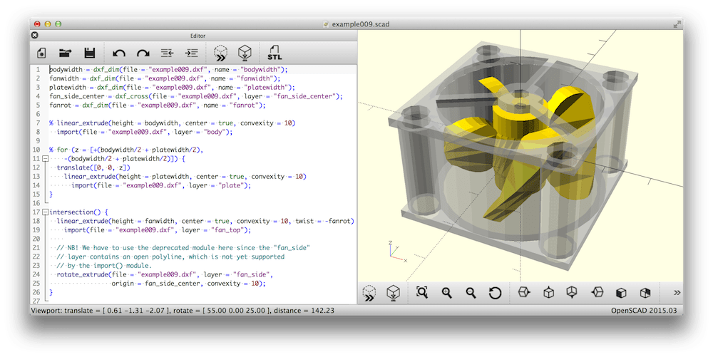

# Convert Video in VR
Convert Your Favorite Video into a Virtual Reality (VR)

## Download the 3Dcombine application.

<a href="https://www.3dcombine.com/Download.html"> Click here for Download</a>

## OpenSCAD is software for creating solid 3D CAD objects.
It is free software and available for Linux/UNIX, MS Windows and Mac OS X.
<a href="https://openscad.org/">https://openscad.org/</a>

<a href="https://openscad.org/downloads.html#linux">Click here for Download</a>

 

